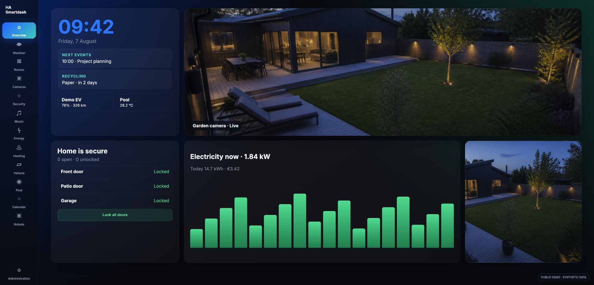
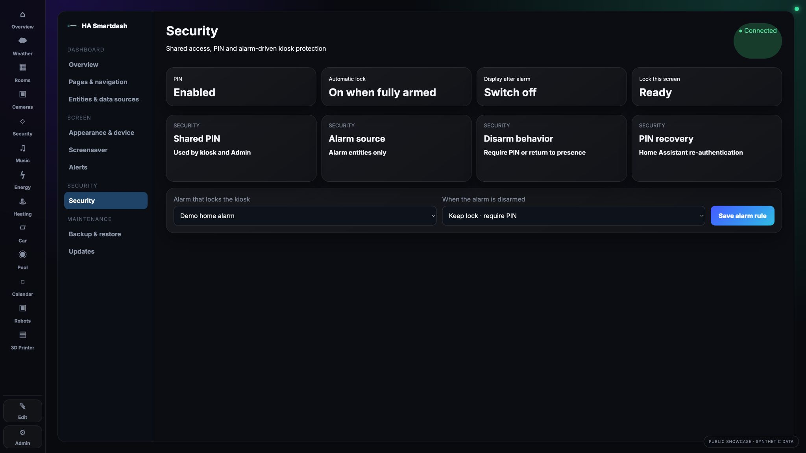
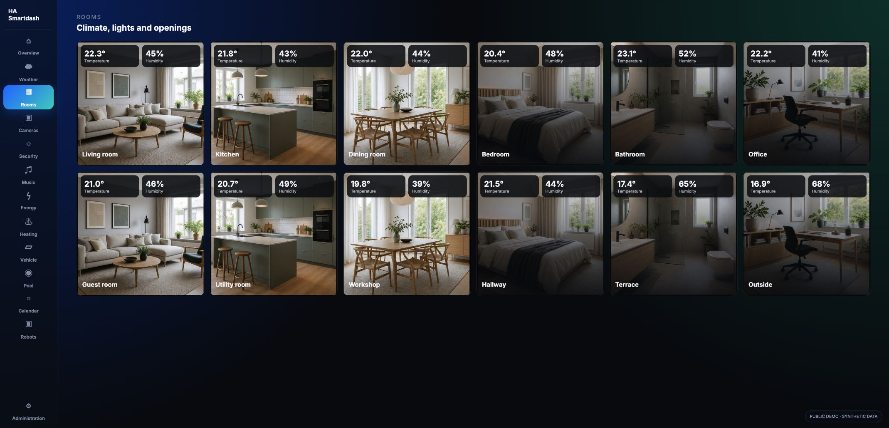
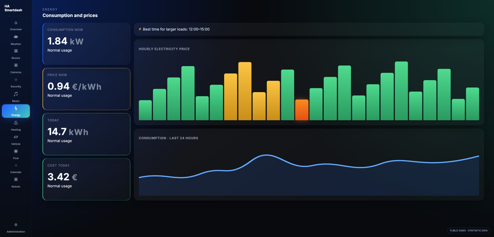
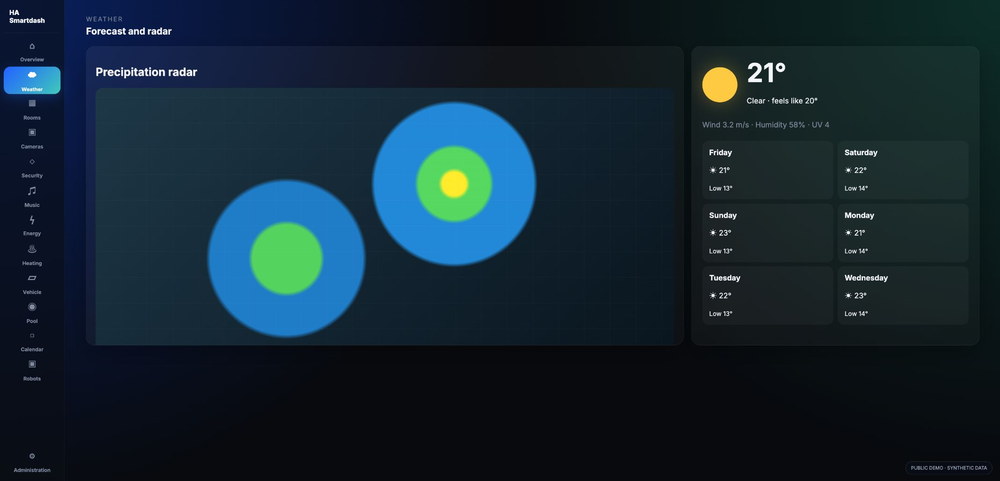
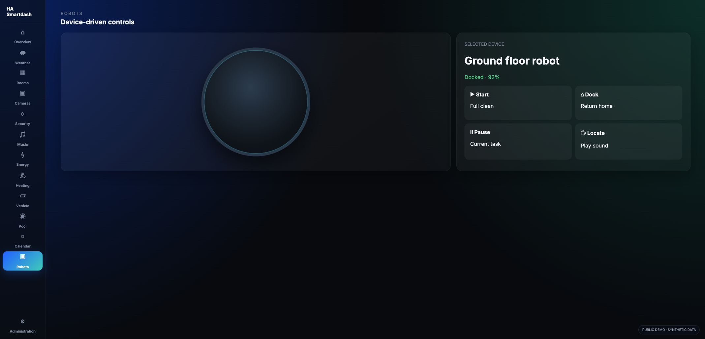
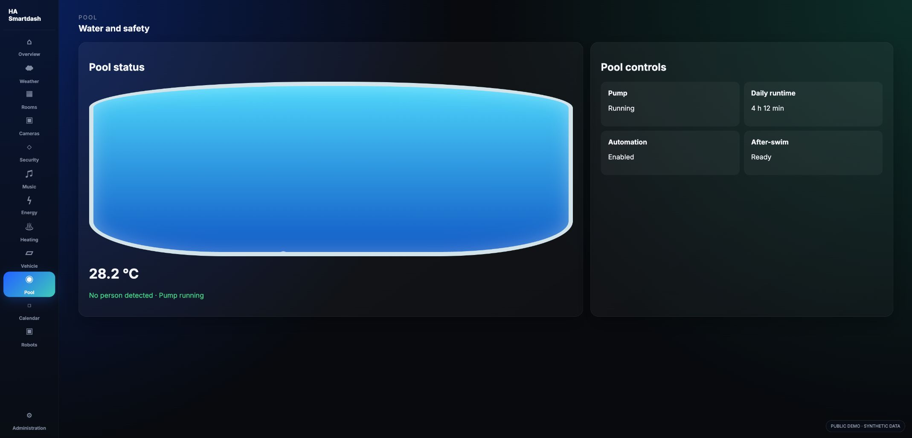
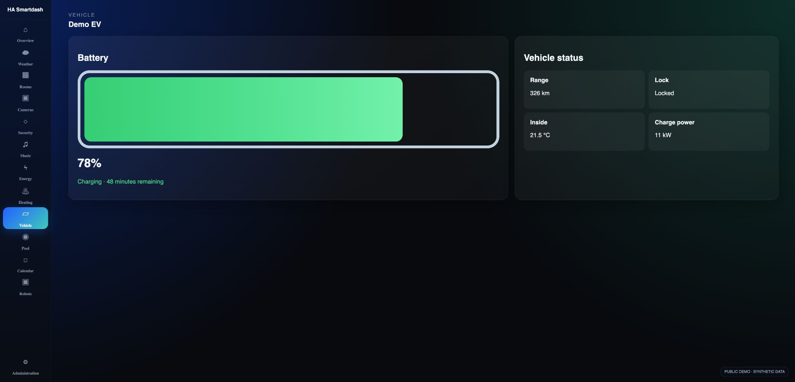

# HA Smartdash

A responsive, configuration-driven kiosk dashboard for Home Assistant. It is designed for touchscreens, wall panels and desktop browsers, while keeping Home Assistant entity choices in one central configuration and device-specific preferences in each browser.

On many kiosk computers and tablets, HA Smartdash can feel faster and use fewer client resources than Home Assistant's full interface. It renders a focused dashboard, loads the entity catalogue once per page session, caches it locally and avoids unnecessary full-page refreshes. Actual performance depends on the device, browser, enabled pages, cameras and Home Assistant integrations.

> [!IMPORTANT]
> HA Smartdash is a personal hobby project, built for the author's own home with assistance from AI. It is shared as-is, without a promise that every Home Assistant installation, integration or device model will work. Forks, experiments and contributions are welcome.

## Screenshot gallery

These screenshots mirror the production dashboard's layout, card proportions and navigation. All values, entity names and rooms are synthetic, and every camera/room image was generated specifically for this repository; no private Home Assistant data or real home is shown.

| Rooms | Energy |
| --- | --- |
|  |  |

| Weather | Device-driven robot |
| --- | --- |
|  |  |

| Pool | Electric vehicle |
| --- | --- |
|  |  |

## Highlights

- Responsive layouts for wide, narrow and portrait screens
- Optional pages for rooms, weather, energy, heating, music, robots, cameras, vehicles, pool and more
- Entity and device-based setup in the admin panel
- Central configuration with per-browser theme, camera placement, PIN and session settings
- Home Assistant entity list loaded once and cached; an explicit refresh action reloads it
- Lightweight kiosk-oriented interface that can reduce browser CPU, memory and network work compared with loading the full Home Assistant UI
- Configurable overview cards, page visibility, branding, browser title and favicon
- Manual Home Assistant address on login
- Local export/import plus scheduled backup to a local folder or server-mounted SMB destination
- Danish and English interface selector
- No analytics, telemetry or required cloud service

The included [production-style showcase](demo/showcase.html) reproduces the dashboard layout with synthetic data and never connects to Home Assistant. A simpler [static demo](demo/index.html) is also included.

## Requirements

- A web server with PHP 8 or newer
- Write permission for the web server user in `data/`
- A same-origin reverse proxy from `/ha/` to Home Assistant, including WebSocket upgrade support
- HTTPS when the dashboard is reachable outside a trusted private network

## Installation

1. Download or clone the repository into your web root.
2. Copy `deploy/nginx.conf.example` into your nginx configuration and adjust the marked paths and Home Assistant address. An equivalent Apache/Caddy setup is also fine.
3. Ensure PHP can write to `data/`.
4. Open `/admin/`, enter your Home Assistant address and authenticate.
5. Select the entities needed by each enabled page and save.
6. Open `/` for the dashboard.

`data/config.json` is created on first save and is ignored by Git. Never commit this file: it can reveal entity IDs and details about your home.

## Configuration ownership

| Stored centrally on the server | Stored locally in each browser |
| --- | --- |
| Entity mappings | Home Assistant login/session |
| Enabled pages and overview cards | PIN and screen lock |
| Shared title and favicon | Theme and display preferences |
| Shared feature settings | Camera placement and kiosk preferences |

The overview builder can add, remove and reorder cards and set responsive sizes. It is intentionally grid-based so layouts remain stable across screen sizes; it is not a free-form pixel canvas.

## Updating without losing configuration

1. In **Admin → Backup & restore**, export the HA Smartdash profile.
2. Replace the application files with the new release, but preserve `data/config.json`.
3. If needed, restore the exported profile from the same admin page.

Older `beast-profile` and `beast-central` profile files can also be imported.

## Automatic backup and SMB

HA Smartdash does not mount network shares or store SMB credentials. Mount the share on the host under `/config/backup-targets/<name>`. Writable subdirectories appear as backup destinations in the admin panel. Scheduling is triggered by dashboard activity, so it is a convenience backup rather than a guaranteed server cron job.

Existing local and SMB backups are listed in the admin panel and can be downloaded directly. See the complete [SMB backup setup guide](deploy/SMB-BACKUP.md).

## Security and privacy

HA Smartdash has no analytics and does not send project data to the author. The browser communicates with the server hosting Smartdash, the configured Home Assistant proxy, and any third-party endpoints you explicitly configure. Review [SECURITY.md](SECURITY.md) before exposing it outside your LAN.

Do not publish:

- `data/config.json`
- `data/backup-settings.json`
- files in `data/backups/`
- screenshots containing names, cameras, calendars, locations or entity IDs
- Home Assistant tokens, cookies or OAuth callback URLs containing secrets

## Project status

This repository is an evolving personal project, not an official Home Assistant product. Test automations and safety-critical behavior directly in Home Assistant; a dashboard should never be the only safety mechanism.

## Languages

English is the repository default. Use the **EN / DA** control in the lower-right corner to store a language choice in the current browser. Danish documentation is available in [README.da.md](README.da.md).

## License and third-party assets

Source code is licensed under the [MIT License](LICENSE). Bundled fonts and weather artwork retain their own licenses; see [THIRD_PARTY_NOTICES.md](THIRD_PARTY_NOTICES.md).

## Contributing

Issues and pull requests are welcome. Please remove personal configuration before sharing logs or screenshots. See [CONTRIBUTING.md](CONTRIBUTING.md).
